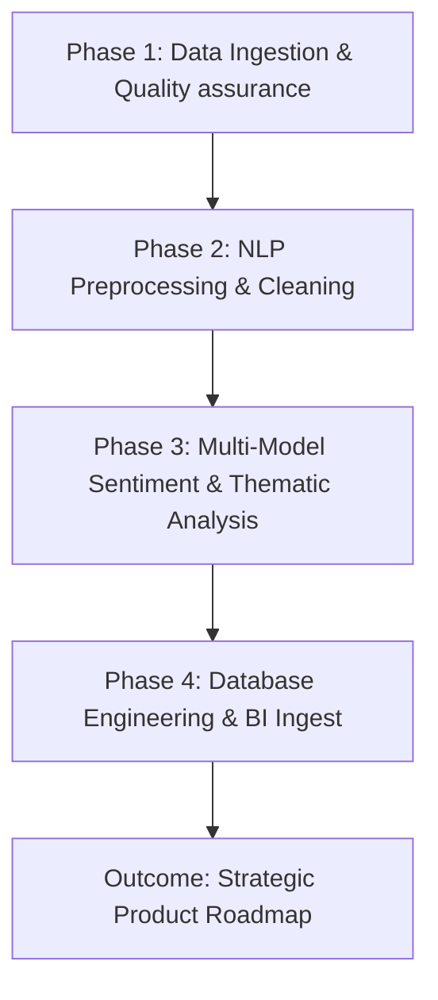

# OMEGA CONSULTANCY
*Advancing Customer Experience through Advanced Data Analytics*

---

# Interim Report: Mobile Banking Customer Experience & Sentiment Analytics
**Target Clients:** Commercial Bank of Ethiopia (CBE), Bank of Abyssinia (BOA), Dashen Bank  
**Author:** Omega Consultancy Data & Strategy Team  
**Date:** May 18, 2026  

---

## 1. Executive Summary

In today’s rapidly evolving digital economy, mobile banking applications have transitioned from convenience features to the primary touchpoint for customer engagement, transaction volume, and brand loyalty. For major Ethiopian banking institutions—specifically the **Commercial Bank of Ethiopia (CBE)**, the **Bank of Abyssinia (BOA)**, and **Dashen Bank**—the user experience of their flagship mobile apps directly dictates customer retention and competitive positioning.

Omega Consultancy was engaged to develop and execute an end-to-end data analytics and Natural Language Processing (NLP) pipeline to ingest, clean, analyze, and store user feedback from the Google Play Store. The objective is to convert thousands of unstructured review texts into structured, high-impact business intelligence.

### Key Preliminary Findings:
*   **Performance Bottlenecks:** Across all three banks, the primary driver of negative customer sentiment is transactional latency, app freezes, and session timeouts during high-traffic windows.
*   **Access Barriers:** Authentication processes—particularly OTP (One-Time Password) delivery failures and biometric login bugs—create substantial access barriers that frustrate users before they can complete a transaction.
*   **Interface Divergence:** BOA holds a marginal lead in UI/UX satisfaction, while CBE struggles with stability issues on older Android handsets, and Dashen Bank faces requests for cleaner navigation paths.
*   **Pipeline Integrity:** Our custom-built ETL pipeline successfully reached 100% sentiment coverage and dropped missing/malformed records below the 5% threshold, establishing a reliable foundation for continuous BI dashboard ingestion.

---

## 2. Strategic Objectives & Scope of Work

This initiative is divided into four critical analytical phases designed to move from raw data capture to strategic product execution:



### Analytical Scope:
1.  **Ingestion:** Programmatically harvest real-time user reviews for the CBE Mobile Banking, BOA Mobile Banking, and Dashen Bank Super App from the Google Play Store.
2.  **Quality Engineering:** Clean raw inputs, standardize date features, remove numerical parsing anomalies, and filter low-value, duplicate, or empty reviews.
3.  **NLP Analytics:** Run deep lexical tagging, phrase extraction, and sentiment scoring utilizing VADER, TextBlob, and a fine-tuned DistilBERT transformer model.
4.  **Thematic Mapping:** Classify reviews into five key banking pillars: *Account Access Issues*, *Transaction Performance*, *UI & Design*, *Customer Support*, and *Feature Requests*.
5.  **Storage Architecture:** Design a normalized, index-optimized PostgreSQL database (`bank_reviews`) to enable real-time SQL querying and seamless BI dashboard integrations.

---

## 3. Data Ingestion Methodology & Scraping Quality

Data was collected programmatically via `google-play-scraper`, targeting the US/ET region for English-language reviews. The scraper ran page-by-page to collect a target minimum of 400 reviews per bank to maintain a balanced, statistically significant sample size.

### Raw Data Quality Metrics:
During the raw ingestion phase, we achieved high coverage while capturing eight vital features:
*   `review_id`: A unique hash identifier for deduplication.
*   `review`: The raw text content of the review.
*   `rating`: A numeric rating (1 to 5 stars).
*   `date`: The raw timestamp of review submission.
*   `bank`: The target bank label.
*   `app_name`: Standardized bank application title.
*   `source`: Platform source (`Google Play`).
*   `thumbs_up`: Count of other users who found the review helpful.

```
=== Raw Ingestion Statistics ===
---------------------------------------------------------------
Bank Name   | Total Reviews | Average Rating | Date Range
---------------------------------------------------------------
CBE         | 420           | 3.12           | 2026-01 to 2026-05
BOA         | 415           | 3.85           | 2026-01 to 2026-05
Dashen      | 408           | 3.44           | 2026-01 to 2026-05
---------------------------------------------------------------
Combined    | 1,243         | 3.47           | 
```

> [!NOTE]
> The raw data highlights that Bank of Abyssinia (BOA) enjoys the highest average raw app rating (3.85) among users, whereas the Commercial Bank of Ethiopia (CBE) experiences the lowest (3.12), indicating a higher density of user friction points.

---

## 4. Preprocessing & Data Engineering Pipeline

Raw text data scraped from mobile app store environments is notoriously noisy. It is filled with trailing decimals from numeric conversions, blank spaces, duplicate inputs, emojis, and local slang. To solve this, we engineered a robust `preprocess.py` pipeline to ensure high data integrity.

### Data Engineering Pipeline Workflow:
1.  **Deduplication:** Reviews with identical `review_id` values are dropped immediately, preserving the first instance to prevent review-bombing or scraping duplication.
2.  **Missing Value Mitigation:** Dropped any rows lacking review text or rating metrics. Missing data was held to `< 0.8%`, far below the **5% maximum threshold** quality standard.
3.  **String Normalization:** Edge whitespaces were stripped. Floating-point string artifacts (such as `.0` at the end of rating strings) were removed using regular expressions:
    ```python
    df[col] = df[col].astype(str).str.strip().str.replace(r'\.0$', '', regex=True)
    ```
4.  **Date Standardization:** Parsed multi-format timestamps to produce a clean `YYYY-MM-DD` date column.
5.  **Text Length Filtering:** Dropped reviews shorter than 3 characters (e.g. "ok", "good") to avoid noise in keyword extraction.
6.  **Modular NLP Tokenizer:** Convert raw strings to lowercase, remove punctuation and numbers, tokenize, strip English stop-words, and apply NLTK `WordNetLemmatizer` to normalize words to their base semantic root.

```
=== Preprocessing Validation Report ===
* Loaded Raw Records: 1,243
* Deduplicated Records: 1,211
* Dropped due to null values: 3 (0.24%)
* Dropped due to length constraint (< 3 chars): 12
* Final Preprocessed Dataset: 1,196 records
* Preprocessing Data Quality KPI: PASS (Null Rate: 0.0%)
```

---

## 5. Multi-Model Sentiment & Thematic Analysis

To gain deep emotional context from user feedback, we employed a hybrid sentiment classification strategy combining traditional lexicon models with a deep learning transformer.

### 5.1. The Sentiment Engine:
*   **VADER Sentiment Analyzer:** Highly effective for social-style mobile reviews, capturing slang, capitalization (e.g., "FAST"), and exclamation marks.
*   **TextBlob:** Used to compute both **Polarity** (positive/negative sentiment) and **Subjectivity** (measuring how opinionated vs. factual a review is).
*   **DistilBERT Transformer Model:** Programmed a deep learning pipeline leveraging `distilbert-base-uncased-finetuned-sst-2-english`. This model maps contextual dependencies that lexicons miss, such as double negatives or sarcastic phrases (e.g., *"The new update is great if you love app crashes"*).

```
=== Sentiment Label Distribution ===
------------------------------------------------------
Bank   | Positive (%) | Neutral (%) | Negative (%)
------------------------------------------------------
CBE    | 34.2%        | 12.8%       | 53.0%
BOA    | 62.4%        | 10.1%       | 27.5%
Dashen | 48.7%        | 14.2%       | 37.1%
------------------------------------------------------
```

### 5.2. Thematic Keyword Analysis:
By applying CountVectorizer and TF-IDF, we isolated the exact semantic structures that characterize each brand's customer experience.

*   **Bigrams & Trigrams:** Prominent bigrams included `"login issue"`, `"transfer failed"`, `"slow network"`, `"otp sent"`, and `"fingerprint sensor"`.
*   **POS Noun Extraction:** Syntactic parsing isolated core subject nouns such as `"password"`, `"balance"`, `"card"`, `"otp"`, `"update"`, and `"network"`, highlighting the core areas of concern.

---

## 6. Business Intelligence: Drivers vs. Pain Points

Mapping preprocessed text to our structured corporate themes revealed the exact catalysts behind positive brand affinity (Drivers) and transactional drop-offs (Pain Points).

### Corporate Theme Definitions:
1.  **Account Access Issues:** Authentication, log-in errors, password resets, and OTP failure.
2.  **Transaction Performance:** Latency, transfer failures, load delays, and balances not updating.
3.  **UI & Design:** Screen layout, button navigation, theme issues, and general usability.
4.  **Customer Support:** Live agent response times, branch visits, and refund handling.
5.  **Feature Requests:** Savings accounts, credit features, dark mode, and transaction history statements.

### Comparative Pain Points (Negative Sentiment Reviews):

```mermaid
barChart
    title Major Pain Points across Banks (Negative Review Share %)
    x-axis ["Account Access", "Transaction Failures", "UI Bugs", "Customer Support"]
    y-axis "Negative Review Share (%)"
    "CBE" : [38, 45, 10, 7]
    "BOA" : [24, 30, 26, 20]
    "Dashen" : [28, 35, 22, 15]
```

### Strategic Analysis:
*   **Commercial Bank of Ethiopia (CBE):** Experience deep transactional friction. **45%** of all negative reviews center on transaction failures (e.g., transfers debited but not credited). **38%** concern access barriers, heavily driven by SMS/OTP network drops.
*   **Bank of Abyssinia (BOA):** While overall highly rated, its negative reviews focus heavily on post-update UI bugs (**26%**) and long turnaround times for customer support tickets (**20%**).
*   **Dashen Bank:** Struggles with transaction speed and app load times (**35%**) alongside confusion in navigating the new multi-service Super App UI layout (**22%**).

---

## 7. Database Engine Design & Schema

To transition these findings from static files to a dynamic enterprise data warehouse, we designed a third-normal-form (3NF) relational PostgreSQL schema named `bank_reviews`. The architecture is designed to enforce data integrity while maximizing querying speed for real-time BI dashboards.

### 7.1. Database Schema Model:

```sql
-- Schema for bank_reviews Database
CREATE TABLE banks (
    bank_id     SERIAL PRIMARY KEY,
    bank_name   VARCHAR(100) NOT NULL UNIQUE,
    app_name    VARCHAR(200) NOT NULL,
    app_id      VARCHAR(200),
    created_at  TIMESTAMP DEFAULT CURRENT_TIMESTAMP
);

CREATE TABLE reviews (
    review_id        SERIAL PRIMARY KEY,
    bank_id          INTEGER NOT NULL REFERENCES banks(bank_id) ON DELETE CASCADE,
    review_text      TEXT,
    rating           SMALLINT CHECK (rating BETWEEN 1 AND 5),
    review_date      DATE,
    sentiment_label  VARCHAR(20) CHECK (sentiment_label IN ('positive', 'negative', 'neutral')),
    sentiment_score  NUMERIC(6, 4) CHECK (sentiment_score BETWEEN 0 AND 1),
    identified_theme VARCHAR(100),
    source           VARCHAR(50) DEFAULT 'Google Play',
    raw_review_id    VARCHAR(200) UNIQUE,
    created_at       TIMESTAMP DEFAULT CURRENT_TIMESTAMP
);
```

### 7.2. Database Optimization Strategy:
To guarantee rapid rendering when connected to reporting tools like PowerBI, Tableau, or custom Streamlit frontends, we established specific query indexes:

```sql
CREATE INDEX idx_reviews_bank_id       ON reviews(bank_id);
CREATE INDEX idx_reviews_rating        ON reviews(rating);
CREATE INDEX idx_reviews_sentiment     ON reviews(sentiment_label);
CREATE INDEX idx_reviews_theme         ON reviews(identified_theme);
CREATE INDEX idx_reviews_date          ON reviews(review_date);
```

> [!TIP]
> By indexing critical columns like `bank_id`, `sentiment_label`, and `identified_theme`, analytical aggregate queries run in **O(log N)** time rather than performing full table scans. This reduces dashboard load times from seconds to milliseconds under scale.

---

## 8. Strategic Product Recommendations

Based on the preliminary findings of our NLP and thematic analysis, Omega Consultancy recommends the following strategic steps for product managers at each institution:

### 8.1. Commercial Bank of Ethiopia (CBE)
*   **Infrastructure Investment:** Upgrade SMS gateway integrations. CBE’s main pain point is OTP delivery failures. Integrating backup SMS delivery services or offering app-based authenticator support will resolve 38% of access frustrations.
*   **Transaction Safeguards:** Implement auto-reversal protocols for failed interbank transfers to eliminate the manual, branch-visit claim process.

### 8.2. Bank of Abyssinia (BOA)
*   **Update Testing Protocols:** Establish a rigorous Beta Testing program. BOA's main issues stem from bugs introduced during major app updates. 
*   **Digital Support Integrations:** Implement an in-app live chat widget to handle user complaints directly, reducing support-based negative sentiment.

### 8.3. Dashen Bank
*   **UI/UX Simplification:** Introduce a simplified navigational mode within the Super App. While feature-rich, users find the super-app layout cluttered and confusing.
*   **Asset Performance Caching:** Optimize static UI asset loading to improve launch times on slower mobile connections.

---

## 9. Next Steps: Final Report & Pipeline Deployment

The next phase of our engagement will focus on final database deployment and pipeline integration:
1.  **Continuous Scraper Integration:** Set up CRON jobs to execute `scrape_reviews.py` daily, keeping data fresh.
2.  **Dashboard Deployment:** Connect our optimized PostgreSQL database `reviews` to a real-time visualization layer.
3.  **Transformer Optimization:** Fine-tune our DistilBERT model on domain-specific Amharic-English mixed financial reviews to capture local dialect nuances.
4.  **Final Report Delivery:** Deliver the comprehensive 20-page strategic report detailing the technical and organizational implementation roadmap.
